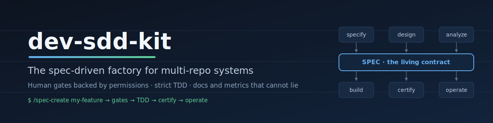

<p align="center">
  
</p>

<h1 align="center">dev-sdd-kit</h1>
<p align="center"><strong>The spec-driven factory for multi-repo systems.</strong><br>
Human gates backed by permissions · strict TDD · docs and metrics that cannot lie.</p>

<p align="center">
  <a href="LICENSE"></a>
  
  
  <a href="CONTRIBUTING.md"></a>
</p>

A **spec-driven development (SDD) workspace template** for
[Claude Code](https://claude.com/claude-code): register any repository — or
several — and the factory clones, indexes and maps it, then takes every
requirement through a full lifecycle where **the spec is the contract**,
humans approve at six permission-backed gates, failing tests are committed
before code, and every document or metric is derived from the real sources.

```bash
git clone https://github.com/mmaripanguec/dev-sdd-kit.git my-system && cd my-system
./scripts/init-system.sh my-system                   # instantiate the template
claude                                                 # launch from the root
/repo-add https://github.com/your-org/your-repo.git    # onboard your first repo
/spec-create my-feature what you need, in plain words  # specify with gates
```

<p align="center">
  
</p>

<p align="center">▶ <strong><a href="docs/demo-assistant.md">Follow the full demo walkthrough</a></strong> — environment from scratch to a running ADK + Gemini customer assistant, with every command and every human gate. Example spec included: <a href="specs/2026-07-customer-assistant-adk.md"><code>specs/2026-07-customer-assistant-adk.md</code></a>.</p>

📐 **[Architecture & usage guide (EN)](docs/architecture.en.html)** ·
**[Documento de arquitectura (ES)](docs/arquitectura.html)** — generated
from the live workspace, always current.

> ⭐ If this approach resonates, a star helps other teams find it.

## Why this exists

AI agents write code fast; what breaks teams is everything around it:
requirements lost in chat, decisions nobody recorded, docs that lie, agents
shipping unchecked. Industry research is consistent about what separates
high performers — and this factory encodes it:

- **DORA 2024–2025**: AI raises throughput but *lowers stability* unless
  engineering discipline gets stronger, not weaker.
- **McKinsey, State of AI 2025**: the practices most correlated with impact
  are full workflow redesign (55% of high performers vs 20%) and formal
  human-in-the-loop validation (65% vs 23%).
- **Anthropic / Thoughtworks**: curated context as infrastructure and
  spec-anchored development — the spec persists and evolves; code is still
  the authority, verified against it.

Every mechanism here maps to those findings: 10 phases (F0 triage → F9
operations), six human gates enforced by *tool permissions* (agents cannot
approve their own work or touch production), strict TDD with untouchable
tests, and derived artifacts with provenance seals that say **"no data"
before they ever make something up**.

## How it compares

Honest differences — each of these tools is good at what it targets:

| | **dev-sdd-kit** | GitHub spec-kit | AWS Kiro | OpenSpec |
|---|---|---|---|---|
| Lifecycle coverage | **F0–F9: triage → operations** (CAB, postmortems, DORA) | spec → implement | spec → implement (IDE) | change proposals |
| Multi-repo systems | **Core design** (`repos.yaml` registry, deploy order, cross-repo specs) | single-repo focus | single-repo focus | single-repo focus |
| Brownfield grounding | **Derived as-is map + code graph + context packs with executable assertions** | limited | limited | delta-based (good) |
| Human gates | **Permission-backed** (agents lack credentials; approvals recorded per commit) | constitution self-checked by the LLM | agent hooks | review-based |
| TDD | **Mandatory, tests untouchable** | optional ("only if requested") | optional | optional |
| Derived docs & metrics | **Architecture doc (EN/ES), as-is, DORA — generated, sealed, CI-checked** | — | — | — |
| Agent ecosystem | Claude Code | **30+ agents** | Kiro IDE | several |
| Maturity / community | Young | **122k★, huge ecosystem** | AWS-backed | growing |

If you want a lightweight spec→code flow with any agent, spec-kit is
excellent. If you run **systems of several existing repositories** and need
the whole lifecycle governed — this is what dev-sdd-kit was built for.

## Architecture at a glance

A requirement flows through 10 phases with six human gates. Phases F0–F5
write the spec; construction and certification run *against* it; operations
feeds knowledge back into the next feature. See the full conceptual diagram
in the [architecture document](docs/architecture.en.html).

```
dev-sdd-kit/
├── README.md · CONTRIBUTING.md · CHANGELOG.md · LICENSE
├── CLAUDE.md                         # Shared context — loaded every session
├── repos.yaml                        # System topology — the single source of truth
│
├── .claude/
│   ├── skills/                       # 14 slash commands (one SKILL.md each)
│   │   ├── spec-create/  spec-review/  clarify/  consistency/
│   │   ├── implement-task/  converge/  harness-init/  orchestrate/
│   │   ├── repo-add/  repo-map/  system-map/
│   │   └── as-is/  as-is-sync/  as-is-learn/
│   ├── agents/                       # 7 phase agents
│   │   ├── requisitos.md  estimacion.md  analisis.md  arquitectura.md
│   │   └── calidad.md  publicacion.md  operacion.md
│   └── rules/                        # 6 rule sets
│       ├── code-style.md  testing.md  security.md
│       └── api-design.md  observability.md  domain-banking.md
│
├── specs/                            # The contracts (every feature starts here)
│   ├── _template.md                  # 12-section spec template
│   ├── 2026-07-generalizacion-workspace.md
│   ├── 2026-07-mejoras-spec-kit.md
│   ├── 2026-07-metricas-dora.md
│   ├── 2026-07-docs-html.md
│   ├── 2026-07-github-docs.md
│   └── 2026-07-customer-assistant-adk.md   # Example: new-app flow (demo, EN)
│
├── knowledge/                        # The system's memory
│   ├── reglas-negocio.md             # Business rules in force (RN-xx)
│   ├── estandares.md                 # Standard → file map
│   ├── uso.md                        # DORA metrics (derived — do not hand-edit)
│   ├── decisiones/_template-adr.md   # Architecture Decision Records
│   ├── incidentes/_template-postmortem.md   # Blameless postmortems
│   └── as-is/  INDEX.md · system.md  # Derived as-is map
│
├── docs/
│   ├── index.html                    # Landing page (GitHub Pages)
│   ├── architecture.en.html · arquitectura.html   # Generated architecture docs
│   ├── demo-assistant.md             # Demo walkthrough (ADK + Gemini assistant)
│   ├── guia-operativa.md             # Full operating guide (ES)
│   ├── instructivo-repo-existente.md # Repo onboarding walkthrough (ES)
│   └── assets/  banner.svg · demo.svg
│
├── templates/                        # What the factory instantiates
│   ├── CLAUDE.repo.md  pack-repo.md  pack-sistema.md  pack-indice.md
│   ├── docs-arquitectura.html  docs-architecture.en.html
│   └── github-actions-as-is.yml
│
├── scripts/                          # Automation + 3 self-test suites (99 asserts)
├── harness/  claude-progress.md      # Multi-session agent harness
└── .github/                          # Issue & PR templates
```

## Documentation

| Document | Language | Purpose |
|---|---|---|
| [docs/architecture.en.html](docs/architecture.en.html) | English | Architecture, technical spec, model & usage guide (generated) |
| [docs/arquitectura.html](docs/arquitectura.html) | Español | Same document in the factory's working language (generated) |
| [docs/guia-operativa.md](docs/guia-operativa.md) | Español | Complete operating guide: installation, auth per provider, E2E cycle, governance |
| [docs/instructivo-repo-existente.md](docs/instructivo-repo-existente.md) | Español | Step-by-step: onboarding an existing repo up to the first spec |
| [CHANGELOG.md](CHANGELOG.md) | English | Release history |

> **A note on language**: public-facing documentation is in English; the
> factory's *working* artifacts (skills, rules, specs, knowledge base) are
> in Spanish by design — it is a working template and its teams operate in
> Spanish. Everything is structured markdown; adapting the language for
> your team is straightforward.

## Contributing

See [CONTRIBUTING.md](CONTRIBUTING.md) — every change follows the factory's
own process: spec first, human gates, failing tests before code, one commit
per task, three suites green. Issues and PRs come with templates.

## License

[MIT](LICENSE) © 2026 Marcos Maripangue
