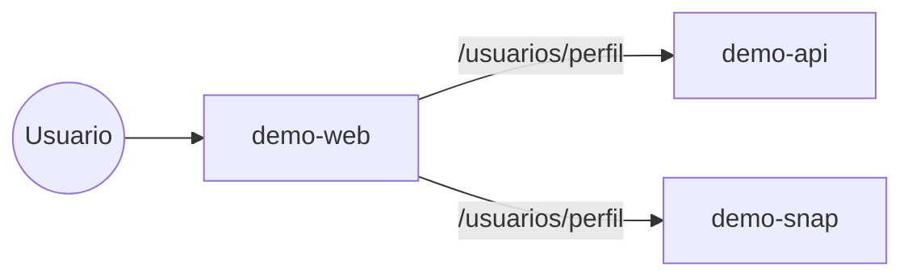

# Sistema demo - vista cross-repo (as-is)
> [GENERADO v8] el 2026-07-18 17:06 UTC - NO EDITAR A MANO. Regenerar: `./scripts/generate-as-is.sh`

## Repositorios
| Repo | Rol | Stack | Servicios externos | Commit | Rama | Ultimo cambio | Archivos | Lineas |
|---|---|---|---|---|---|---|---|---|
| [demo-api](demo-api/) | API de negocio | express | PostgreSQL,Redis,HTTP-saliente | `c2ca196` | main | 2026-07-18 | 1 | 4 |
| [demo-web](demo-web/) | frontend web | react | - | `8c92f89` | main | 2026-07-18 | 1 | 1 |
| [demo-snap](demo-snap/) | snapshot exportado | express | PostgreSQL,Redis,HTTP-saliente | `404a3ee005f8` | snapshot | - | 1 | 4 |

**Orden de despliegue declarado (repos.yaml):** demo-api -> demo-web -> demo-snap

## Comunicacion entre repos (heuristica: rutas expuestas vs. consumidas)

_Heuristica por coincidencia de rutas. El detalle por repo esta en_
_<repo>/api-surface.md. Para precision total: contratos OpenAPI por repo._
