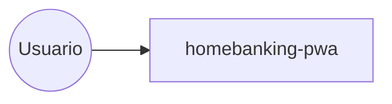

# Sistema homebanking - vista cross-repo (as-is)
> [GENERADO v6] el 2026-07-17 23:51 UTC - NO EDITAR A MANO. Regenerar: `./scripts/generate-as-is.sh`

## Repositorios
| Repo | Stack | Commit | Rama | Ultimo cambio | Archivos | Lineas |
|---|---|---|---|---|---|---|

## Comunicacion entre repos (heuristica: rutas expuestas vs. consumidas)

_Heuristica por coincidencia de rutas. El detalle por repo esta en_
_<repo>/api-surface.md. Para precision total: contratos OpenAPI por repo._
